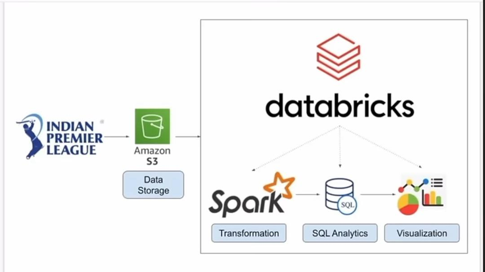

# End-to-End Data Engineering Pipeline for IPL Data

# Introduction
This project is an end-to-end data engineering pipeline designed to analyze Indian Premier League (IPL) data.
The goal is to transform raw data into actionable insights using modern cloud and big data technologies

## Architecture

# Technology used

Amazon S3 → Data storage (raw datasets)

Databricks + PySpark → Data transformation & ETL for large-scale processing

Pandas → Data cleaning, preprocessing, and exploration

SQL Analytics → Querying and extracting insights

Visualization → Interactive dashboards for reporting

## Dataset used

The IPL dataset used in this project is available here: 

[https://data.world/raghu543/ipl-data-till-2017]
